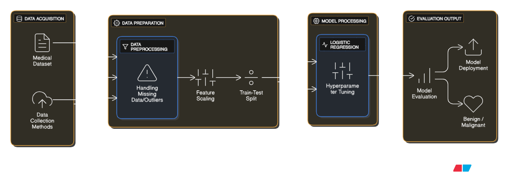

# 🧬 Breast Cancer Classification Using Machine Learning

A machine learning–based classification system that analyzes medical diagnostic features to predict whether a breast tumor is **Benign** or **Malignant**, helping in early and accurate cancer detection.

---

## 🚀 Features

### 🔹 Core Functionalities
- Medical dataset loading and exploration
- Data preprocessing and cleaning
- Feature scaling for improved model performance
- Train-test data splitting
- Binary classification (Benign vs Malignant)
- Model performance evaluation

### 🤖 Machine Learning Capabilities
- Predicts cancer type based on diagnostic measurements
- Compares multiple ML models
- Evaluates accuracy, precision, recall, and F1-score
- Helps identify important diagnostic features

---

## 🧠 Machine Learning Models Used
- Logistic Regression
- Support Vector Machine (SVM)
- K-Nearest Neighbors (KNN)

---

## 📊 Dataset Information
- **Dataset**: Breast Cancer Wisconsin (Diagnostic)
- **Source**: UCI ML Repository / sklearn datasets
- **Samples**: 569
- **Features**: 30 numeric diagnostic features
- **Target Classes**:
  - `0` → Malignant
  - `1` → Benign

---

## 🏗️ System Architecture




---

## 📁 Project Structure
```
Breast_Cancer_Classification/
│
├── Breast_Cancer_Classification.ipynb
├── dataset.csv # (if used externally)
├── README.md
```


---

## 📈 Evaluation Metrics
- Accuracy
- Confusion Matrix
- Precision
- Recall
- F1-score

---

## 🧪 Results Summary
- Logistic Regression and SVM achieved high accuracy
- Feature scaling significantly improved model performance
- Models showed strong capability to distinguish between benign and malignant tumors
- Low false-negative rate, which is critical for medical diagnosis

---

## 🖥️ Output
- Jupyter Notebook–based implementation
- Visualizations for feature distributions and correlations
- Printed evaluation metrics and confusion matrices

---

## 🚀 Future Scope
- Deploy the model as a web application using **Streamlit** or **Flask**
- Add deep learning models for improved accuracy
- Integrate real-time patient input forms
- Implement explainable AI techniques (SHAP / LIME) for medical interpretability

---

## 📄 License
MIT License © 2025
